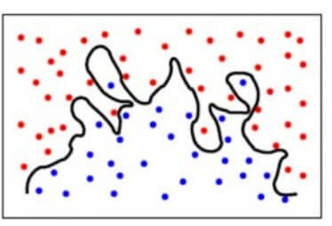

## What is Bias?
In the simplest terms, Bias is the difference between the Predicted Value and the Expected Value. To explain further, the model makes certain assumptions when it trains on the data provided. When it is introduced to the testing/validation data, these assumptions may not always be correct.

In our model, if we use a large number of nearest neighbors, the model can totally decide that some parameters are not important at all.  For example, it can just consider that the Glusoce level and the Blood Pressure decide if the patient has diabetes. This model would make very strong assumptions about the other parameters not affecting the outcome. You can also think of it as a model predicting a simple relationship when the datapoints clearly indicate a more complex relationship:

 
Mathematically, let the input variables be X and a target variable Y. We map the relationship between the two using a function f.

Therefore,

                                      Y = f(X) + e
                                      
Here ‘e’ is the error that is normally distributed. The aim of our model f'(x) is to predict values as close to f(x) as possible. Here, the Bias of the model is:

                                  Bias[f'(X)] = E[f'(X) – f(X)]

As I explained above, when the model makes the generalizations i.e. when there is a high bias error, it results in a very simplistic model that does not consider the variations very well. Since it does not learn the training data very well, it is called Underfitting  
## What is a Variance?
Contrary to bias, the Variance is when the model takes into account the fluctuations in the data i.e. the noise as well. So, what happens when our model has a high variance?

The model will still consider the variance as something to learn from. That is, the model learns too much from the training data, so much so, that when confronted with new (testing) data, it is unable to predict accurately based on it.

Mathematically, the variance error in the model is:

                               Variance[f(x))=E[X^2]−E[X]^2

Since in the case of high variance, the model learns too much from the training data, it is called overfitting.

In the context of our data, if we use very few nearest neighbors, it is like saying that if the number of pregnancies is more than 3, the glucose level is more than 78, Diastolic BP is less than 98, Skin thickness is less than 23 mm and so on for every feature….. decide that the patient has diabetes. All the other patients who don’t meet the above criteria are not diabetic. While this may be true for one particular patient in the training set, what if these parameters are the outliers or were even recorded incorrectly? Clearly, such a model could prove to be very costly!

Additionally, this model would have a high variance error because the predictions of the patient being diabetic or not vary greatly with the kind of training data we are providing it. So even changing the Glucose Level to 75 would result in the model predicting that the patient does not have diabetes.

To make it simpler, the model predicts very complex relationships between the outcome and the input features when a quadratic equation would have sufficed. This is how a classification model would look like when there is a high variance error/when there is overfitting:

### To summarise,

<li>A model with a high bias error underfits data and makes very simplistic assumptions on it
<li>A model with a high variance error overfits the data and learns too much from it
<li>A good model is where both Bias and Variance errors are balanced
