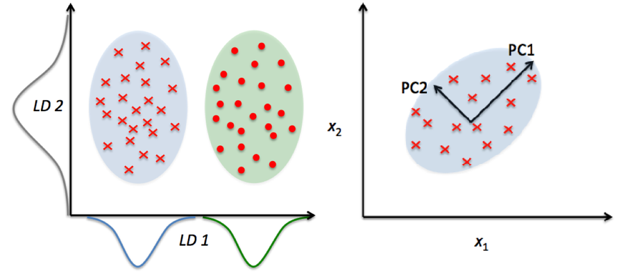

# Dimensionality Reduction

The number of input variables or features for a dataset is referred to as its dimensionality.

Dimensionality reduction refers to techniques that reduce the number of input variables in a dataset.

More input features often make a predictive modeling task more challenging to model, more generally referred to as the curse of dimensionality.

High-dimensionality statistics and dimensionality reduction techniques are often used for data visualization. Nevertheless these techniques can be used in applied machine learning to simplify a classification or regression dataset in order to better fit a predictive model

I will discover a gentle introduction to dimensionality reduction for machine learning

### After reading this, you will know:

<li>Large numbers of input features can cause poor performance for machine learning algorithms.</li>
<li>Dimensionality reduction is a general field of study concerned with reducing the number of input features.</li>
<li>Dimensionality reduction methods include feature selection, linear algebra methods, projection methods, and autoencoders.</li>

## Problem With Many Input Variables

The performance of machine learning algorithms can degrade with too many input variables.

If your data is represented using rows and columns, such as in a spreadsheet, then the input variables are the columns that are fed as input to a model to predict the target variable. Input variables are also called features.

We can consider the columns of data representing dimensions on an n-dimensional feature space and the rows of data as points in that space. This is a useful geometric interpretation of a dataset.

Having a large number of dimensions in the feature space can mean that the volume of that space is very large, and in turn, the points that we have in that space (rows of data) often represent a small and non-representative sample.

This can dramatically impact the performance of machine learning algorithms fit on data with many input features, generally referred to as the “curse of dimensionality.”

Therefore, it is often desirable to reduce the number of input features.

This reduces the number of dimensions of the feature space, hence the name “dimensionality reduction.”

## Dimensionality Reduction

Dimensionality reduction refers to techniques for reducing the number of input variables in training data.

     When dealing with high dimensional data, it is often useful to reduce the dimensionality by projecting the data to a lower dimensional subspace
                      which captures the   “essence” of the data. This is called dimensionality reduction.

High-dimensionality might mean hundreds, thousands, or even millions of input variables.

Fewer input dimensions often mean correspondingly fewer parameters or a simpler structure in the machine learning model, referred to as degrees of freedom. A model with too many degrees of freedom is likely to overfit the training dataset and therefore may not perform well on new data.

It is desirable to have simple models that generalize well, and in turn, input data with few input variables. This is particularly true for linear models where the number of inputs and the degrees of freedom of the model are often closely related.

         The fundamental reason for the curse of dimensionality is that high-dimensional functions have the potential to be much more complicated than low-dimensional ones, 
                and that those complications are harder to discern. The only way to beat the curse is to incorporate knowledge about the data that is correct.

Dimensionality reduction is a data preparation technique performed on data prior to modeling. It might be performed after data cleaning and data scaling and before training a predictive model.

     dimensionality reduction yields a more compact, more easily interpretable representation of the target concept, focusing the user’s 
                attention on the most relevant variables.

As such, any dimensionality reduction performed on training data must also be performed on new data, such as a test dataset, validation dataset, and data when making a prediction with the final model.

## Techniques for Dimensionality Reduction

There are many techniques that can be used for dimensionality reduction.

In this section, we will review the main techniques.

### 1.Feature Selection Methods
Perhaps the most common are so-called feature selection techniques that use scoring or statistical methods to select which features to keep and which features to delete.

            perform feature selection, to remove “irrelevant” features that do not help much with the classification problem.

Two main classes of feature selection techniques include wrapper methods and filter methods.

For more on feature selection in general, see the tutorial:

Wrapper methods, as the name suggests, wrap a machine learning model, fitting and evaluating the model with different subsets of input features and selecting the subset the results in the best model performance. RFE is an example of a wrapper feature selection method.

Filter methods use scoring methods, like correlation between the feature and the target variable, to select a subset of input features that are most predictive. Examples include Pearson’s correlation and Chi-Squared test.

## 2.Matrix Factorization
Techniques from linear algebra can be used for dimensionality reduction.

Specifically, matrix factorization methods can be used to reduce a dataset matrix into its constituent parts.

Examples include the eigendecomposition and singular value decomposition.

A Gentle Introduction to Matrix Factorization for Machine Learning
The parts can then be ranked and a subset of those parts can be selected that best captures the salient structure of the matrix that can be used to represent the dataset.

## 3.Manifold Learning

Techniques from high-dimensionality statistics can also be used for dimensionality reduction.

        In mathematics, a projection is a kind of function or mapping that transforms data in some way.

These techniques are sometimes referred to as “manifold learning” and are used to create a low-dimensional projection of high-dimensional data, often for the purposes of data visualization.

The projection is designed to both create a low-dimensional representation of the dataset whilst best preserving the salient structure or relationships in the data.

Examples of manifold learning techniques include:

<li>Kohonen Self-Organizing Map (SOM).
<li>Sammons Mapping
<li>Multidimensional Scaling (MDS)
<li>t-distributed Stochastic Neighbor Embedding (t-SNE).</li>

The features in the projection often have little relationship with the original columns, e.g. they do not have column names, which can be confusing to beginners.
